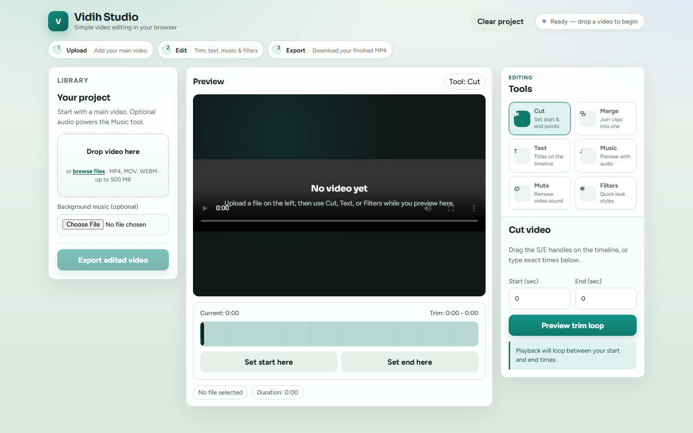

# Vidih Studio

Browser video editor with FFmpeg export (cut, merge, text, mute, filters, music).

## Screenshots

### Studio

## Requirements

- XAMPP (PHP)
- FFmpeg at `C:\ffmpeg\bin\ffmpeg.exe`, or set env var `VIDIH_FFMPEG` to your binary path

## Notes

- Uploaded media and exports older than 7 days are cleaned automatically
- Max upload size defaults to 500 MB (also limited by PHP `upload_max_filesize`)
- Music selected in Library is included in edited exports
